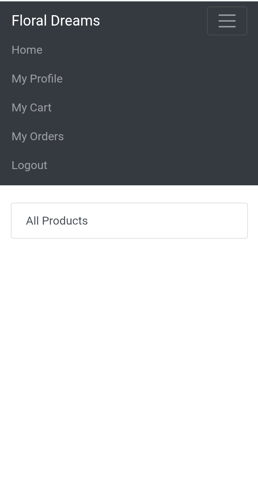

## Floral Dreams

A Django-based e-commerce web application for browsing and managing flower, gift, and lifestyle products.

## Features

- Product browsing by category
- Product detail pages
- Customer registration and login
- Shopping cart management
- Checkout and order history
- Django admin panel
- Product image uploads
- Render deployment with Gunicorn

## Screenshots




## Tech Stack

- Python
- Django
- SQLite for local development
- PostgreSQL for production
- Gunicorn
- WhiteNoise
- Pillow
- Bootstrap

## Project Structure

```text
floral-dreams/
├── manage.py
├── requirements.txt
├── images/
├── templates/
├── floral_dreams_app/
└── floral_dreams_project/
```

## Run Locally

Clone the repository:

```bash
git clone https://github.com/manishlab-ai/floral-dreams.git
cd floral-dreams
```

Create and activate a virtual environment:

### Windows

```bash
python -m venv venv
venv\Scripts\activate
```

### macOS/Linux

```bash
python3 -m venv venv
source venv/bin/activate
```

Install dependencies:

```bash
pip install -r requirements.txt
```

Apply migrations:

```bash
python manage.py makemigrations floral_dreams_app
python manage.py migrate
```

Create an admin user:

```bash
python manage.py createsuperuser
```

Start the development server:

```bash
python manage.py runserver
```

Open the application:

```text
http://127.0.0.1:8000/
```

## Admin Panel

```text
http://127.0.0.1:8000/admin/
```

Add categories and products through the admin panel to display products on the homepage.

## Render Deployment

### Build Command

```bash
pip install -r requirements.txt && python manage.py makemigrations floral_dreams_app && python manage.py migrate && python manage.py collectstatic --noinput
```

### Start Command

```bash
gunicorn floral_dreams_project.wsgi:application --bind 0.0.0.0:$PORT
```

### Environment Variables

```text
PYTHON_VERSION=3.11.9
DJANGO_SECRET_KEY=your-secure-secret-key
DEBUG=False
```

## Important Notes

- Products must be added through the admin panel before they appear on the homepage.
- SQLite is suitable for local testing.
- PostgreSQL is recommended for production.
- Uploaded media files should use persistent storage in production.

## Repository

[View the source code on GitHub](https://github.com/manishlab-ai/floral-dreams)

## License

This project is intended for educational and portfolio purposes.


## Live Demo

[Open Floral Dreams](https://collage-management-portal.onrender.com)


